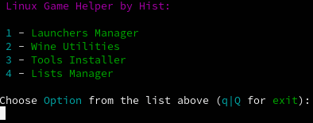
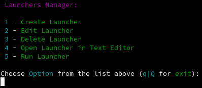
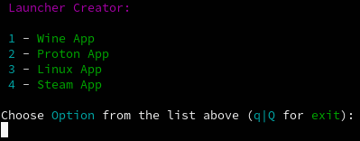
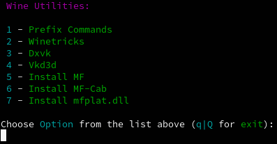
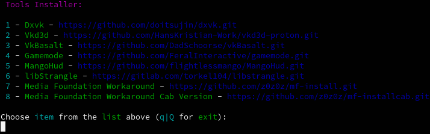
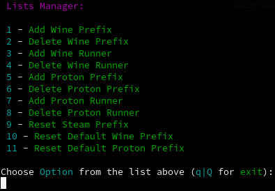

# Linux Game Helper by Hist
## About:
Small console program written in bash.
## Features:
+ Creating, editing Launchers for Wine, Proton, Linux and Steam applications.   
 Launchers support various settings:   
   - Selecting Prefix.   
   - Selecting Wine/Proton version.   
   - Enabling Gamemode, Mangohud, vkBasalt.    
   - Enabling and setup libstrangle.   
   - Enabling and setup DxvkHUD.   
   - Different Wine, Proton, Dxvk, Nvidia and AMD options.
+ Installing vkBasalt, Gamemode, Mangohud and libstrangle.
+ Various Wine options:   
   - Prefix Commands (winecfg, control, regedit, etc.).   
   - Winetricks.   
   - Installing Dxvk, Vkd3d, MF, MF-Cab per Prefix.
+ Prefixes and Runners Control:   
   - Adding, creating and removing Wine/Proton Prefixes.   
   - Adding and removing Wine/Proton Runners.   
   - Reseting Steam Proton Prefixes
## Installation:
Clone the repo:

    git clone https://github.com/sergeyhist/hist-game-helper.git
    cd hist-game-helper

Run hgh-installer script:

    sh hgh-installer.sh
    
## Usage:
Simply input this command in terminal:

    histgamehelper
    
## Screenshots:
   
   
   
   
   
   